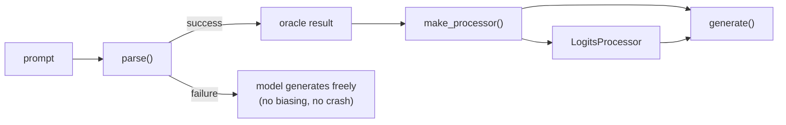
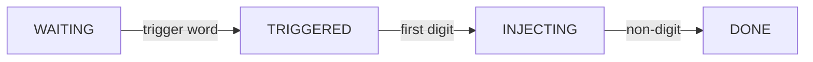

Ground LLM generation in real computation. The model writes prose; turnstyles guarantee the facts.

A turnstyle intercepts generation at the token level, running an oracle (anything from `a + b` to arbitrary Python in a WASM sandbox) and steering the model toward the correct answer. Every intervention is audited.

```python
from turnstyle import SandboxTurnstyle

t = SandboxTurnstyle(model, tokenizer, device)

# The model writes the explanation. The sandbox computes the answer.
text, proof = t.generate("""What does this return?
```python
primes = [n for n in range(2, 100) if all(n % i != 0 for i in range(2, int(n**0.5)+1))]
len(primes)
```""")
# proof.answer == 25
```

The code runs in a WASM sandbox — no network, no filesystem, no syscalls. The model can't hallucinate a number that the sandbox actually computed.

## BBH, solved deterministically — no model

`DispatchTurnstyle` routes each prompt to a typed solver and grounds the answer. On [BIG-Bench-Hard](https://github.com/suzgunmirac/BIG-Bench-Hard), the symbolic tasks are solved by *parsing and computing* — the LLM never runs:

| BBH task | Accuracy (no model) |
|---|---|
| arithmetic · boolean · dyck · word-sorting · web-of-lies · logical-deduction (3 / 5 / 7) | **100%** |
| navigate | 94.4% |
| date_understanding | 44% — a deterministic *floor*; the NL tail **abstains** (→ defer to a model), never guesses |

**2346 / 2500 = 93.8% across 10 BBH tasks, no model, in seconds.** Anything it can't parse, it abstains on — graceful fallback, never a wrong answer.

[](https://colab.research.google.com/github/jdonaldson/turnstyle/blob/main/experiments/bbh_eval_colab.ipynb) — run the eval yourself.

## Turnstyles

Every turnstyle follows the same pattern: `parse()` runs an oracle, `make_processor()` wires the answer into logit biasing, `generate()` lets the model write freely while the coprocessor enforces correctness.

| Turnstyle | Oracle | Example |
|-----------|--------|---------|
| `SandboxTurnstyle` | Arbitrary Python in WASM | `` "What does `sum(range(101))` return?" `` |
| `ArithmeticTurnstyle` | `+`, `-`, `*`, `/` | "What is 445 + 152?" |
| `DateTurnstyle` | Date arithmetic | "How many days between Jan 1 and Mar 20?" |
| `UnitTurnstyle` | Physical unit conversion | "How many km is 26.2 miles?" |
| `CurrencyTurnstyle` | Currency conversion | "How much is 100 USD in EUR?" |
| `PercentageTurnstyle` | Percentages, tips, discounts | "What is 15% of 230?" |
| `CountingTurnstyle` | Letters, vowels, words | "How many r's in 'strawberry'?" |
| `BaseConversionTurnstyle` | Binary, hex, octal | "What is 255 in binary?" |

The specialized turnstyles (arithmetic, dates, etc.) are fast pattern-matched oracles. `SandboxTurnstyle` is the general case — if you can write Python for it, you can ground generation in it.

## How it works

A turnstyle is a bridge between two systems: a neural network that generates language and a symbolic oracle that computes facts. The bridge is HuggingFace's `LogitsProcessor` interface — a hook that runs after the model produces logits for each token but before the token is sampled.

### The pipeline



The oracle extracts a computable problem from the prompt. `ArithmeticTurnstyle` uses regex to find `445 + 152` → `597`. `SandboxTurnstyle` extracts Python code and runs it in a WASM sandbox. If parsing fails, the model generates freely — no intervention, no crash.

`make_processor()` creates a `LogitsProcessor` preloaded with the answer digits `[5, 9, 7]` and a digit-to-token mapping for the model's tokenizer. The processor is passed to `generate()`, which lets the model write freely while the coprocessor enforces correctness.

### The state machine

During generation, the `LogitsProcessor` walks through four states:



| State | What happens | Transition |
|-------|-------------|------------|
| **WAITING** | Watches for trigger words (`is`, `=`, `equals`) | → TRIGGERED on trigger |
| **TRIGGERED** | Waits for the first digit token | → INJECTING on digit |
| **INJECTING** | Adds `+15.0` to the correct digit's logit each step | → DONE on non-digit |
| **DONE** | Counts any extra digits (model rambling) | terminal |

This trigger-word state machine is the digit coprocessor (`ArithmeticLogitsProcessor`). The general-purpose `SequenceLogitsProcessor` takes `immediate=True` — it skips `WAITING`/`TRIGGERED` and biases from the first generated token, no trigger word needed (that's what the hello-world below uses).

### Logit biasing

The coprocessor doesn't force tokens — it *biases* them. At each digit position, it adds a fixed offset (default `15.0`) to the logit of the correct digit:

```
Model's logits for digit position 0:
  "6" → 10.2  (model's top choice — wrong)
  "5" →  9.1  (correct answer)
  "4" →  3.7
  ...

After coprocessor bias (+15.0 to "5"):
  "5" → 24.1  ← now top choice
  "6" → 10.2
  "4" →  3.7
```

If the model was already going to emit the correct digit, the bias is a no-op. If the model was wrong, the bias flips the ranking. Either way, the correction is recorded in the audit trail.

### Audit trail

Every digit gets a `DigitAudit` recording what the model wanted vs. what the oracle computed:

```python
text, proof = t.generate("What is 445 + 152?")

print(proof.inline()) # ⊢ 445+152=5̲97 ∎
print(proof.detail())
# ⊢ 445+152=597  1/3 corrected  Δ=0.05
#   d0: [6→5]  logit_gap=+1.0
#   trigger@step 14/19  state=DONE
```

**Annotation marks:**
- `5̲` underline — digit corrected by coprocessor
- `5̂` circumflex — digit the model never emitted
- `⊢` turnstile — "this was derived"
- `∎` QED — "proof complete"

Use `proof.inline(plain=True)` for annotation-free output.

## Build your own

A turnstyle is any subclass of `Turnstyle` that implements two methods: `parse()` runs your oracle, `make_processor()` wires the answer into logit biasing. If `parse()` returns `None`, the model generates freely — no biasing, no crash.

**Hello world** — the smallest solver. `SequenceLogitsProcessor` steers the model toward any answer *string* (letters, a word, an option):

```python
import re
from turnstyle.core import Turnstyle, SequenceLogitsProcessor

class ReverseTurnstyle(Turnstyle):
    """The model often flubs letter order; the oracle doesn't."""

    def parse(self, prompt: str):
        m = re.search(r"reverse(?:\s+the\s+word)?:?\s+(\w+)", prompt, re.I)
        return m.group(1)[::-1] if m else None       # None -> the model generates freely

    def make_processor(self, parsed, max_new_tokens: int):
        answer_ids = self.tokenizer.encode(parsed, add_special_tokens=False)
        return SequenceLogitsProcessor(
            self.tokenizer, answer_ids,
            expression="reverse", answer_str=parsed,
            bias_strength=self.bias_strength,
            max_new_tokens=max_new_tokens, immediate=True,
        )
```

```python
t = ReverseTurnstyle(model, tokenizer, device)
text, _ = t.generate("Reverse the word: turnstyle")   # -> "elytsnrut"
```

`parse()` is your oracle — compute the answer however you like (regex, a library call, a simulation). `make_processor()` steers the model to emit it.

**For numeric answers**, `ArithmeticLogitsProcessor` biases digit-by-digit and produces the audited `5̲97` trail:

```python
from turnstyle.core import Turnstyle
from turnstyle.arithmetic import ArithmeticLogitsProcessor

class FibonacciTurnstyle(Turnstyle):
    """Ground Fibonacci answers in real computation."""

    def parse(self, prompt: str):
        """Extract a computable problem, or return None to skip biasing."""
        import re
        m = re.search(r'(\d+)(?:th|st|nd|rd)?\s+fibonacci', prompt, re.I)
        if not m:
            return None
        n = int(m.group(1))
        a, b = 0, 1
        for _ in range(n):
            a, b = b, a + b
        return n, a  # (index, answer)

    def make_processor(self, parsed, max_new_tokens: int):
        """Wire the oracle's answer into a LogitsProcessor."""
        n, answer = parsed
        return ArithmeticLogitsProcessor(
            self.tokenizer,
            answer_digits=[int(d) for d in str(answer)],
            expression=f"fib({n})",
            answer_value=answer,
            bias_strength=self.bias_strength,
            max_new_tokens=max_new_tokens,
        )
```

That's it. `parse()` is your oracle — compute the answer however you want. `make_processor()` wires it into digit biasing. If `parse()` returns `None`, the model generates freely.

```python
t = FibonacciTurnstyle(model, tokenizer, device)
text, proof = t.generate("What is the 10th Fibonacci number?")
# proof.answer == 55
```

## Routing many solvers: `DispatchTurnstyle`

`DispatchTurnstyle` routes a prompt to the right solver automatically through a typed `Task` dispatch. Deterministic solvers (arithmetic, dates, web-of-lies, navigation, logical deduction) ground the answer exactly; multiple-choice tasks route through a per-option probe; anything it can't solve falls back to plain generation.

```python
from turnstyle import DispatchTurnstyle

dt = DispatchTurnstyle(model, tokenizer, device)
dt.generate("What is 3 * (4 + 5)?")[0]           # "27"     — deterministic, grounded
dt.generate("Complete the brackets: ( ( [")[0]   # "] ) )"

# Multiple choice: fit a per-option probe once (autoprobe), then route through it
dt.fit_choice(snarks_examples)
dt.generate(snarks_prompt)[0]                     # "(B)"    — probe pick, grounded
```

Each prompt is parsed into a typed variant (`Task = Arithmetic | MultipleChoice | … | FreeForm`), solved, and grounded back into the model's output. Step-by-step walkthrough, one stage per cell:

[](https://colab.research.google.com/github/jdonaldson/turnstyle/blob/main/experiments/dispatch_walkthrough_colab.ipynb) · or `experiments/dispatch_walkthrough.ipynb` locally.

## Probe routing

`DispatchTurnstyle` (above) routes automatically via typed dispatch. The lower-level
`RoutingTurnstyle` routes among a **custom set of turnstyles** using a linear probe on
model hidden states — for novel phrasings that regex can't catch.

Regex-first, probe-fallback: existing parse patterns are tried first. The probe
only activates when no regex matches.

```python
from turnstyle import RoutingTurnstyle, TurnstyleProbe

probe = TurnstyleProbe.load("probe_weights.pt")
router = RoutingTurnstyle(
    turnstyles=[ArithmeticTurnstyle(model, tokenizer, device),
                DateTurnstyle(model, tokenizer, device)],
    probe=probe,
    layer_index=23,  # model-specific
)
text, proof = router.generate("Sum of four hundred forty-five and one fifty-two")
```

Train a probe by collecting hidden states at your target layer for labeled
prompts, then fitting a logistic regression. Save as a `.pt` file with
`TurnstyleProbe.save()`.

## SandboxTurnstyle

Extracts Python from prompts via fenced code blocks, inline backticks (`` `expr` ``), "what does X return" patterns, or directives (`Evaluate: expr`). Bare arithmetic falls through to `ArithmeticTurnstyle`.

```python
from turnstyle import SandboxTurnstyle

t = SandboxTurnstyle(model, tokenizer, device)

text, proof = t.generate("What does `sum(range(101))` return?")
text, proof = t.generate("Evaluate: sum(int(d) for d in str(2**100))")
```

See [docs/sandbox.md](docs/sandbox.md) for the full reference — code extraction patterns, backends, error behavior, and V1 limitations.

## Install

```bash
pip install turnstyle
```

Requires `torch` and `transformers`. Works with any HuggingFace causal LM.

For sandbox support (runs Python in a WASM sandbox):
```bash
pip install turnstyle[sandbox]
```

This installs `wasmtime` and auto-downloads CPython WASM on first use. Falls back to [Deno](https://deno.land) + Pyodide if wasmtime is unavailable.

For probe routing and `DispatchTurnstyle.fit_choice` (the `autoprobe` sweep needs scikit-learn):
```bash
pip install turnstyle[sweep]
```

## References

Turnstyle is an implementation of **neurosymbolic programming** — combining neural generation with symbolic computation through constrained decoding.

- Chaudhuri, S., Ellis, K., Polozov, O., Singh, R., Solar-Lezama, A., & Yue, Y. (2021). [Neurosymbolic Programming](https://www.nowpublishers.com/article/Details/PGL-049). *Foundations and Trends in Programming Languages*, 7(3), 158–243.
- [Neuro-symbolic AI](https://en.wikipedia.org/wiki/Neuro-symbolic_AI) — Wikipedia overview of the broader field.
